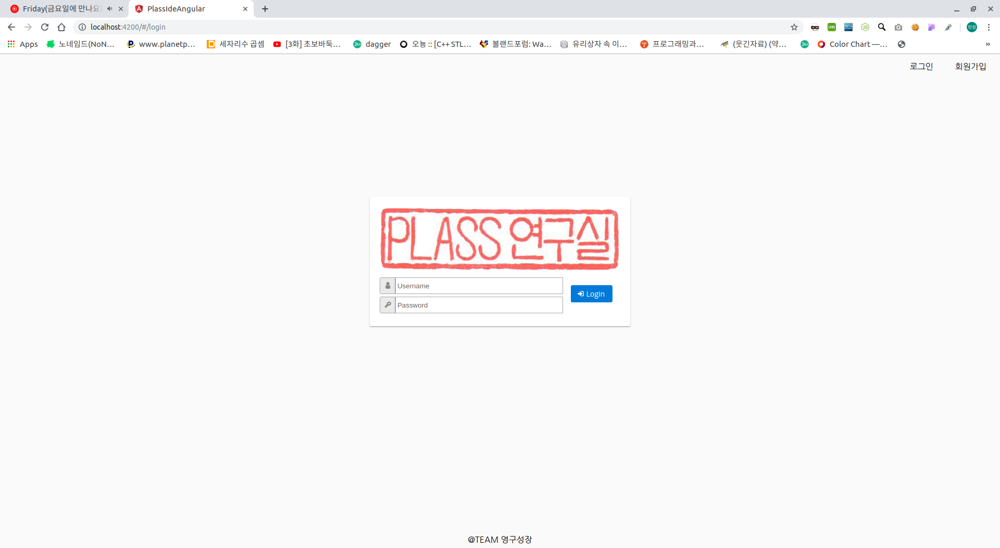
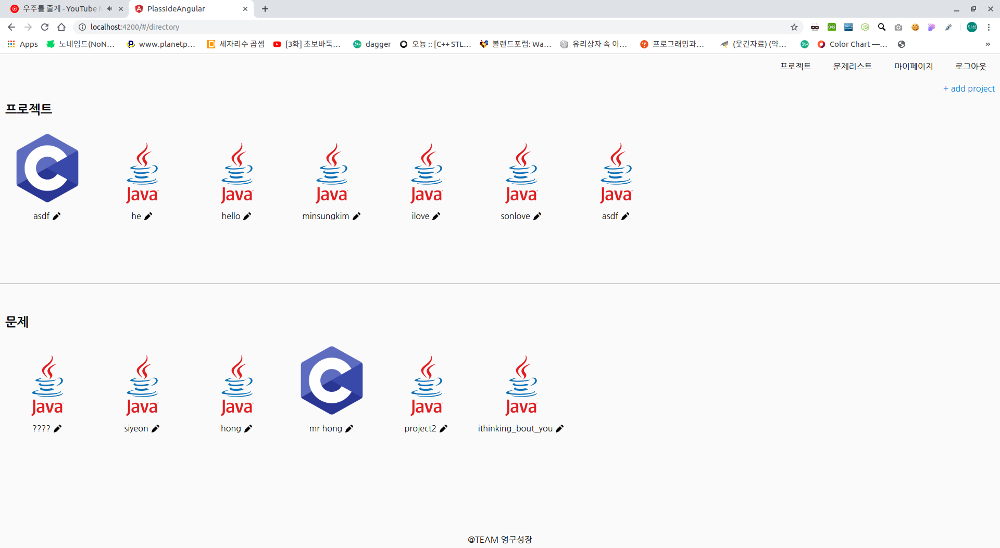
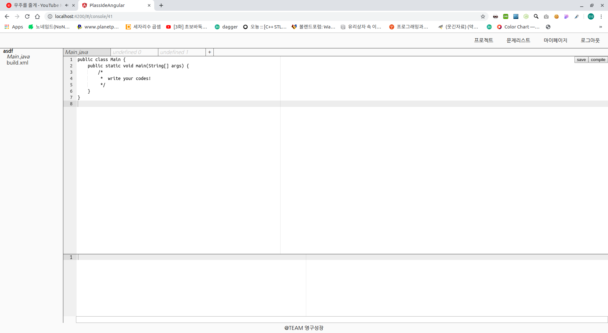
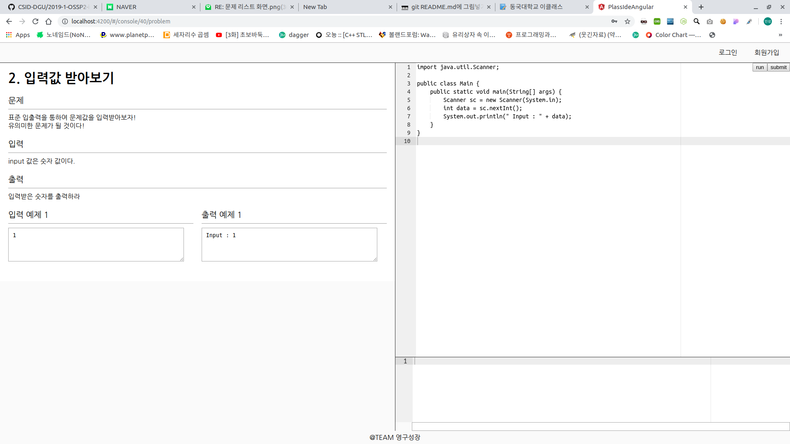
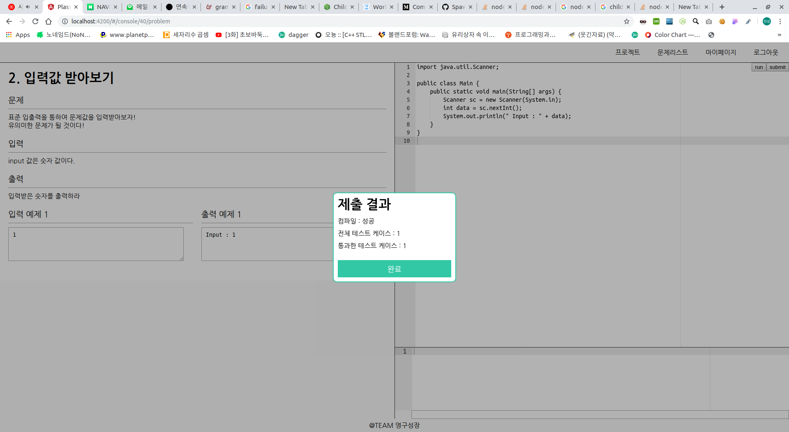
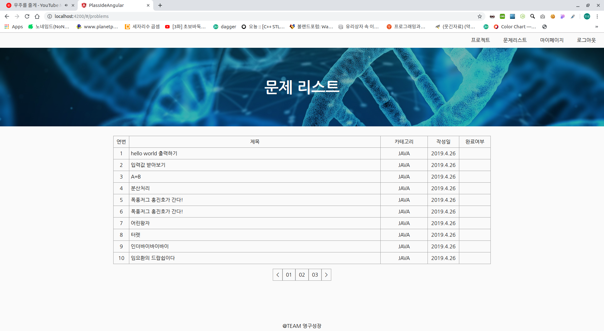
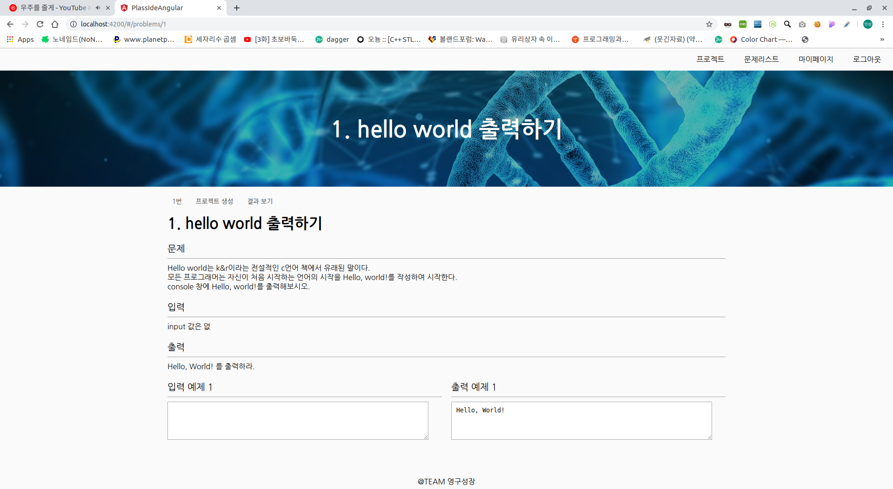
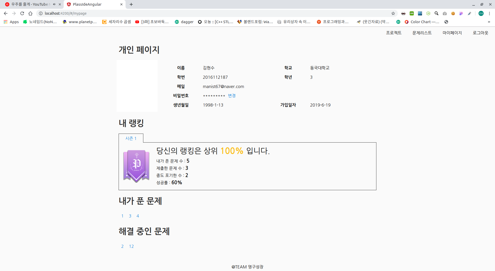

# 프로젝트 설명

> 동국대학교 컴퓨터공학과 학생들을 위한 통합 개발 환경 구축

 * 별도의 설치 과정없이 웹에서 바로 코딩할 수 있는 WEB IDE

 * 컴퓨터공학과 학생들을 위한 코딩 문제 제공

 

# 개발 환경

 

#### os: Linux debian

#### IDE: visual studio code

#### Database: >=Mysql5.6

#### NPM: >=6.9.0

 

# 실행 방법

위 프로젝트는 두 가지 프로젝트로 이루어져있다.

1. back-end

## Build Docker

docker를 사용하기 위하여 

https://docs.docker.com/ee/

위의 url을 통하여 docker를 다운받는다.

 

그 후 프로젝트 root 디렉토리에서 다음과 같이 실행한다

> sudo docker ./docker/build.sh

 

## Run express application

express 어플리케이션은 typescript로 작성되어 있다.

위 express를 run하기 위해서 다음 모듈들을 전역으로 다운받는다.

1. ts-node

2. nodemon

다운 받는 법은 다음과 같다.

> npm install -g ts-node

 

> npm install -g nodemon

 

이후 plass-lab-backend 디렉토리로 이동 후에

> npm install

 

모든 npm 의존성 모듈들을 다운받는다.

그 후 상황에 맞춰 다음과 같이 실행한다.

> sudo npm start // 서버 시작

> sudo npm run start:live // 서버 autoreload 기능 시작

 

docker를 사용하기 위해서 관리자 권한으로 실행시켜준다.

 

2. Front-end

## Angular

plass-lab-frontend 디렉토리 이동 후 모든 의존성을 다운받는다.

> npm install

 

그 후 자동으로 다운받아진 angular-cli를 이용하는 다음과 같은 명령로 실행시킨다. 

> npm start

 

만약 서버에 배포 하려면 다음과 같이 build 후.

> npm build

 ./plass-lab-frontend/build 파일을 업로드한다

 

# 실행 화면

1. 시작 화면

2. 로그인 페이지

3. 디렉토리 페이지 

4. 프로젝트 에디터 페이지

4. 문제 에디터 페이지

4. 문제 제출 페이지

5. 문제 페이지

6. 문제 상세페이지

7. 마이 페이지

